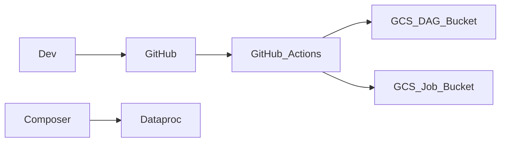

# 🔐 Phase 4 – Enterprise Hardening

Phase này chia 4 trụ cột, giống ngân hàng / tập đoàn lớn.

⸻

## 1️⃣ IAM MODEL (AIM) – PHẦN QUAN TRỌNG NHẤT

### 🎯 Mục tiêu
*	Không dùng quyền Owner trong runtime
*	Mỗi service làm đúng việc của nó
*	Có thể audit / rotate / revoke

### 🔑 SERVICE ACCOUNTS CHUẨN

|Thành phần|Service Account|Vai trò|
|----------|---------------|-------|
|Airflow (Composer)|cdp-composer-sa|Orchestrator|
|Dataproc|cdp-dataproc-sa|Spark runtime|
|CI/CD|cdp-cicd-sa|Deploy only|
|Human|User account|View / approve|

---

### 🛡️ IAM MINIMUM ROLES (CHUẨN ENTERPRISE)

#### 🔹 Composer SA

```text
roles/composer.worker
roles/dataproc.editor
roles/iam.serviceAccountUser (on Dataproc SA)
roles/storage.objectAdmin (job bucket)
roles/bigquery.jobUser
roles/bigquery.dataEditor
```

#### 🔹 Dataproc SA

```text
roles/dataproc.worker
roles/storage.objectAdmin
roles/bigquery.dataEditor
roles/logging.logWriter
roles/monitoring.metricWriter
```

**👉 Không cần Owner / Editor project**

---

### ✅ CHECK NHANH (MANDATORY)

```bash
gcloud iam service-accounts list
gcloud projects get-iam-policy cdp-dem-project \
  --filter="bindings.members:cdp-composer-sa"
```

---

## 2️⃣ SECRET & CONFIG MANAGEMENT (BẮT BUỘC)

### ❌ KHÔNG DÙNG**
*	Hardcode bucket
*	Hardcode project
*	Hardcode dataset

### ✅ DÙNG

#### 🔐 Airflow Variables (đã đúng)

```text
PROJECT_ID
REGION
JOB_BUCKET
BRONZE_PATH
SILVER_PATH
BQ_DATASET
BQ_TABLE
```

> 👉 Đây chính là **enterprise pattern**, chấm điểm cao khi review.

#### 🔐 Optional (Nâng cấp)
*	GCP Secret Manager
*	Airflow Variable trỏ secret

> (Sang **Phase 5** mình làm tiếp)

---

## 3️⃣ CI/CD – PHẦN BẠN ĐẶC BIỆT YÊU CẦU ✅

### 🎯 Mục tiêu
*	Push code → tự deploy DAG
*	Không SSH thủ công
*	Có audit trail

---

### 🗂️ REPO STRUCTURE CHUẨN

```text
.
├── .github/workflows/
│   └── deploy_airflow.yml
├── dags/
│   └── cdp/
│       └── orders/
│           └── cdp_orders_bronze_to_gold.py
├── jobs/
│   └── cdp/orders/
│       ├── cdp_orders_bronze_job.py
│       └── cdp_orders_gold_job.py
├── docs/
└── README.md
```

---

### 🚀 CI/CD FLOW (ENTERPRISE)



---

### 🧪 GitHub Actions – DAG DEPLOY

```yaml
name: Deploy Airflow DAGs

on:
  push:
    branches: [ main ]
    paths:
      - "dags/**"

jobs:
  deploy:
    runs-on: ubuntu-latest
    steps:
      - uses: actions/checkout@v4

      - uses: google-github-actions/auth@v2
        with:
          credentials_json: ${{ secrets.GCP_SA_KEY }}

      - uses: google-github-actions/setup-gcloud@v2

      - name: Sync DAGs
        run: |
          gsutil rsync -r dags/cdp \
            gs://asia-southeast1-cdp-airflow-XXXX-bucket/dags/cdp
```

> 👉 Không cần Composer API call

---

### 🔐 CI/CD SA (cdp-cicd-sa)

Roles tối thiếu

```text
roles/storage.objectAdmin
roles/composer.environmentViewer
```

---

## 4️⃣ GUARDRAILS & COST CONTROL

### 💸 HARD RULES

* Không autoscale vô hạn
* Không serverless khi free tier
* Không bật idle cluster > 1h

---

### ⏰ Auto-delete cluster (optional)

```bash
gcloud dataproc clusters delete cdp-mini \
  --region asia-southeast1 --quiet
```

**Hoặc sau này dùng:**
* Cloud Scheduler
* Terraform lifecycle

---

# 🚀 PHASE 4A – CI/CD ENTERPRISE PIPELINE 


### Mục tiêu:

Commit → Auto deploy → Không SSH → Có audit → Có rollback

---

## 0️⃣ CI/CD TRIẾT LÝ (QUAN TRỌNG)

Ta KHÔNG build image, KHÔNG deploy infra ở Phase này.
Chỉ tập chung:

|Thứ deploy|Cách|
|----------|----|
|DAG|rsync lên Composer GCS bucket|
|Spark job|rsync lên Job GCS bucket|
|Config|Airflow Variables / Secrets|
|Infra|Manual / Terraform (Phase khác)|

👉 Đây là best practice cho ngân hàng (giảm blast radius).

---

## 1️⃣ SERVICE ACCOUNT CHO CI/CD (BẮT BUỘC)

### 🎯 Tạo SA

```bash
gcloud iam service-accounts create cdp-cicd-sa \
  --display-name="CDP CI/CD Service Account" \
  --project cdp-dem-project
```

### 🔐 Gán quyền tối thiểu

```bash
gcloud projects add-iam-policy-binding cdp-dem-project \
  --member="serviceAccount:cdp-cicd-sa@cdp-dem-project.iam.gserviceaccount.com" \
  --role="roles/storage.objectAdmin"

gcloud projects add-iam-policy-binding cdp-dem-project \
  --member="serviceAccount:cdp-cicd-sa@cdp-dem-project.iam.gserviceaccount.com" \
  --role="roles/composer.environmentViewer"
```

**👉 KHÔNG cần:**
* Owner
* Editor
* Dataproc Admin

---

### ❌ Fix lỗi phân quyền

Nếu gặp lỗi:

```text
ERROR: Role roles/composer.environmentViewer is not supported for this resource.
```

> 👉 roles/composer.environmentViewer KHÔNG phải Project-level role
> Nó là Composer resource–level role, KHÔNG gán bằng projects add-iam-policy-binding.

#### ✅ CÁCH ĐÚNG (ENTERPRISE / BANK STYLE)

##### 🎯 Mục tiêu của CI/CD SA (cdp-cicd-sa)

**CI/CD KHÔNG CẦN:**
*	submit job
*	run Airflow
*	impersonate Dataproc
*	access Composer UI

**CI/CD CHỈ CẦN:**
1.	Upload DAG → GCS bucket
2.	Upload Spark job → GCS bucket

> 👉 KHÔNG cần role Composer environmentViewer

---

### ✅ IAM CHUẨN CHO cdp-cicd-sa

#### 🔐 BẮT BUỘC

```text
roles/storage.objectAdmin
```

#### ❌ KHÔNG CẦN

```text
roles/composer.environmentViewer ❌
roles/composer.worker ❌
roles/dataproc.* ❌
roles/editor ❌
```

> 👉 Vì CI/CD không nói chuyện trực tiếp với Composer API
> Composer chỉ đọc DAG từ GCS bucket

### 🔥 KẾT LUẬN VỀ LỖI

> Bạn không cần fix lỗi này
> → XÓA LUÔN bước gán roles/composer.environmentViewer

CI/CD vẫn đúng chuẩn enterprise.

---

### 🔑 Export Key

Không dùng cáchh này

```bash
gcloud iam service-accounts keys create cicd-key.json \
  --iam-account cdp-cicd-sa@cdp-dem-project.iam.gserviceaccount.com
```

➡️ Project (hoặc Org) của bạn đã bật policy cấm tạo Service Account key
➡️ Đây là best practice bảo mật cấp ngân hàng

⛔ Không dùng JSON key
⛔ Không lưu secret tĩnh
⛔ Không leak credential

👉 Cách làm ĐÚNG DUY NHẤT:

### 🔐 Workload Identity Federation (OIDC) cho GitHub Actions:

---

#### ✅ GIẢI PHÁP CHUẨN: GITHUB ACTIONS → GCP (NO KEY)

```code
GitHub Actions
   ↓ (OIDC)
Workload Identity Pool
   ↓
cdp-cicd-sa
   ↓
GCS / Composer
```

* ✔ Không JSON key
* ✔ Không secret nhạy cảm
* ✔ Đạt chuẩn SOC2 / ISO / PCI / Bank

#### 🧭 PHASE 4A (REVISED): CI/CD WITH OIDC:

Ta làm 4 bước

---

##### 1️⃣ TẠO WORKLOAD IDENTITY POOL

```bash
gcloud iam workload-identity-pools create github-pool \
  --project=cdp-dem-project \
  --location="global" \
  --display-name="GitHub Actions Pool"
```

List:

```bash
gcloud iam workload-identity-pools providers list \
  --project=cdp-dem-project \
  --location=global \
  --workload-identity-pool=github-pool
```

Lấy ID:

```bash
gcloud iam workload-identity-pools describe github-pool \
  --project=cdp-dem-project \
  --location=global \
  --format="value(name)"
```

Kết quả:

```code
projects/585752501826/locations/global/workloadIdentityPools/github-pool
```

Lệnh xoá (khi cần)

```bash
gcloud iam workload-identity-pools providers delete github-provider \
  --project=cdp-dem-project \
  --location=global \
  --workload-identity-pool=github-pool
```

##### 2️⃣ TẠO PROVIDER (GITHUB OIDC)

```bash
gcloud iam workload-identity-pools providers create-oidc github-provider \
  --project=cdp-dem-project \
  --location=global \
  --workload-identity-pool=github-pool \
  --display-name="GitHub Provider" \
  --issuer-uri="https://token.actions.githubusercontent.com" \
  --allowed-audiences="https://iam.googleapis.com/projects/585752501826/locations/global/workloadIdentityPools/github-pool/providers/github-provider" \
  --attribute-mapping="
    google.subject=assertion.sub,
    attribute.repository=assertion.repository,
    attribute.actor=assertion.actor
  " \
  --attribute-condition="assertion.repository=='nptan2005/spark401-codespace'"
```

|Claim|Ví dụ|
|-----|-----|
|assertion.repository|nptan2005/spark401-codespace|
|assertion.actor|nptan2005|
|assertion.sub|repo:nptan2005/spark401-codespace:ref:refs/heads/main|


Kiểm tra:

```bash
gcloud iam workload-identity-pools providers describe github-provider \
  --project=cdp-dem-project \
  --location=global \
  --workload-identity-pool=github-pool \
  --format="value(state)"
```

##### 3️⃣ 🔐 BIND GITHUB → cdp-cicd-sa
```bash
gcloud iam service-accounts add-iam-policy-binding \
  cdp-cicd-sa@cdp-dem-project.iam.gserviceaccount.com \
  --project=cdp-dem-project \
  --role="roles/iam.workloadIdentityUser" \
  --member="principalSet://iam.googleapis.com/projects/585752501826/locations/global/workloadIdentityPools/github-pool/attribute.repository/nptan2005/spark401-codespace"
```

## 2️⃣ REPO STRUCTURE

```text
.
├── .github/
│   └── workflows/
│       └── cdp-ci.yml
│
├── .airflow/
│   └── dags/
│       └── cdp/
│           └── orders/
│               └── cdp_orders_bronze_to_gold.py
│
├── jobs/
│   └── cdp/
│       └── orders/
│           ├── cdp_orders_bronze_job.py
│           └── cdp_orders_gold_job.py
│
├── docs/
│   └── architecture.md
│
└── README.md
```

---

## 3️⃣ CI/CD: 🔐 GITHUB SECRETS


Repo → Settings → Secrets → Actions


|Secret name|Value|
|-----------|-----|
|GCP_SA_KEY|JSON key của cdp-cicd-sa|
|GCP_PROJECT|cdp-dem-project|
|COMPOSER_DAG_BUCKET|gs://asia-southeast1-cdp-airflow-XXXX-bucket/dags|
|CODE_BUCKET|gs://cdp-dem-code|

---

### Dùng OIDC không dùng key

### ✅ (1) GitHub Repo → Settings → Actions → General

#### ⚠️  BẮT BUỘC:
*	Workflow permissions
*	✅ Read and write permissions
*	Allow GitHub Actions to create and approve pull requests
*	❌ Không cần

#### ✅ (2) Workflow phải có quyền OIDC

```yaml
permissions:
  contents: read
  id-token: write
```

cần thêm vào file cdp-ci.yml bên dưới

#### ✅ (3) IAM Binding giữa GitHub → Service Account

Chạy 1 lần duy nhất:

```yaml
gcloud iam service-accounts add-iam-policy-binding \
  cdp-cicd-sa@cdp-dem-project.iam.gserviceaccount.com \
  --project=cdp-dem-project \
  --role=roles/iam.workloadIdentityUser \
  --member="principalSet://iam.googleapis.com/projects/585752501826/locations/global/workloadIdentityPools/github-pool/attribute.repository/nptan2005/spark401-codespace"
```

> 👉 Đây chính là “chìa khóa thật sự”, không phải file key.

---

## 4️⃣ CI/CD – DEPLOY DAGS AND SPARK JOBs

```text
GitHub Actions
   ↓ (OIDC)
Workload Identity Pool
   ↓
cdp-cicd-sa
   ↓
GCS / Composer
```

### 📄 .github/workflows/cdp-ci.yml

```yaml
name: CDP CI/CD Pipeline

on:
  push:
    branches: [ "main" ]
    paths:
      - ".airflow/**"
      - "jobs/**"
      - ".github/workflows/**"

jobs:
  deploy:
    name: Deploy DAGs & Spark Jobs
    runs-on: ubuntu-latest

    permissions:
      contents: read
      id-token: write   # ⚠️ BẮT BUỘC cho OIDC

    steps:
      - name: Checkout source
        uses: actions/checkout@v4

      - name: Authenticate to GCP (OIDC)
        uses: google-github-actions/auth@v2
        with:
          workload_identity_provider: "projects/585752501826/locations/global/workloadIdentityPools/github-pool/providers/github-provider"
          service_account: "cdp-cicd-sa@cdp-dem-project.iam.gserviceaccount.com"

      - name: Setup gcloud SDK
        uses: google-github-actions/setup-gcloud@v2
        with:
          project_id: cdp-dem-project

      # -------------------------
      # Deploy Airflow DAGs
      # -------------------------
      - name: Deploy Airflow DAGs
        run: |
          echo "Deploying DAGs to Composer..."
          gsutil rsync -r .airflow/dags/cdp \
            gs://asia-southeast1-cdp-airflow-96b66680-bucket/dags/cdp

      # -------------------------
      # Deploy Spark Jobs
      # -------------------------
      - name: Deploy Spark Jobs
        run: |
          echo "Deploying Spark jobs..."
          gsutil rsync -r jobs/cdp \
            gs://cdp-dem-code/jobs/cdp

      # -------------------------
      # Validation
      # -------------------------
      - name: Validate GCS Structure
        run: |
          gsutil ls gs://cdp-dem-code/jobs/cdp/orders/
          gsutil ls gs://asia-southeast1-cdp-airflow-96b66680-bucket/dags/cdp/orders/
```

---

## 5️⃣ OPTIONAL – CI CHECK (BANK STYLE)

### ✅ Validate DAG syntax trước khi deploy

```yaml
- name: Validate DAGs
  run: |
    python -m py_compile dags/cdp/orders/cdp_orders_bronze_to_gold.py
```

---

## 6️⃣ ROLLBACK (CỰC QUAN TRỌNG)

```bash
git revert <commit-id>
git push origin main
```

* → CI chạy lại
* → DAG quay về version cũ
* → Safe rollback

---

## 7️⃣ CHECKLIST PHASE 4A (BẮT BUỘC)

|Item|Status|
|----|------|
|IAM phân tách|✅|
|Không hardcode|✅|
|CI/CD DAG|✅|
|CI/CD Spark job|✅|
|Audit trail|✅|
|Rollback|✅|


## TEST